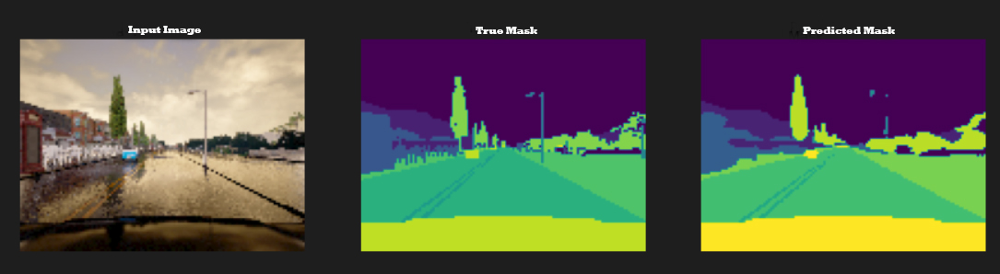

# Image-Segmentation-using-Unet

New Computer Vison project.

Image Segmentation using U-NET.

A brief about the notebook:

1- Importing & Visualizing Data (CARLA)

2- Data PreProcessing

3- U-net (Encoder & Decoder)

6- Building The Model

7- Training the Model

8- Model Evaluation

9- Showing Predicitons

